TimeSeries Prediction of Cancer in Japan
================

## Time series analysis using ARIMA model to cancer data

All data refer to sources
[below](https://ganjoho.jp/reg_stat/statistics/data/dl/index.html).

-   Cancer Statistics. Cancer Information Service, National Cancer
    Center, Japan (Vital Statistics of Japan, Ministry of Health, Labour
    and Welfare)  
-   Cancer Statistics. Cancer Information Service, National Cancer
    Center, Japan　(Monitoring of Cancer Incidence in Japan (MCIJ))  
    Cancer incidence and incidence rates in Japan in 2009: a study of 32
    population-based cancer registries for the Monitoring of Cancer
    Incidence in Japan (MCIJ) project.[Japanese Journal of Clinical
    Oncology 2015; 45:
    884-91](https://ganjoho.jp/external.html?url=https%3A%2F%2Fpubmed.ncbi.nlm.nih.gov%2F26142437%2F&title=Japanese%20Journal%20of%20Clinical%20Oncology%202015;%2045:%20884-91)

In this Analysis some data include Japanese character (日本語) but we
will try to refrain from using Japanese language data to avoid encoding
problems.

``` r
d_incidence <- read.csv("input/cancer_incidence_jpn.csv",check.names = F)
d_mortality <- read.csv("input/cancer_mortality_jpn.csv",check.names = F)
pop <- read.csv("input/population_all_jpn.csv",check.names = F)

head(d_incidence)
```

    ##   code   part year    all  0_4 5_9 10_14 15_19 20_24 25_29 30_34 35_39 40_44
    ## 1    1 全部位 1975 206702 1325 717   658   706  1196  2649  3876  6054 10543
    ## 2    1 全部位 1976 209320 1294 692   619   701   979  2935  3378  6017 10454
    ## 3    1 全部位 1977 216218 1332 713   614   840   862  2927  3483  6398 10607
    ## 4    1 全部位 1978 224040 1213 700   528   811   838  2428  3723  6776 10609
    ## 5    1 全部位 1979 239835 1187 665   497   779   889  2186  4211  7911 10614
    ## 6    1 全部位 1980 251041 1194 713   587   715   948  1883  4727  7473 10640
    ##   45_49 50_54 55_59 60_64 65_69 70_74 75_79 80_84 over85
    ## 1 15533 17360 20139 27374 30496 30218 22603 11003   4250
    ## 2 15435 18339 19703 26883 31879 29370 23934 12061   4645
    ## 3 15947 19220 19816 27279 33319 29762 25101 13080   4916
    ## 4 16158 20903 20703 27143 34554 30991 26686 13706   5573
    ## 5 16913 22961 23687 28362 35673 33772 28361 14898   6268
    ## 6 17299 23606 25614 29307 36127 37339 29503 16408   6959

``` r
head(d_mortality)
```

    ##   code   part year    all 0_4 5_9 10_14 15_19 20_24 25_29 30_34 35_39 40_44
    ## 1    1 全部位 1958  87895 562 429   383   470   575   951  1611  2350  3832
    ## 2    1 全部位 1959  91286 532 371   442   533   563   976  1714  2439  3926
    ## 3    1 全部位 1960  93773 604 383   486   521   596   932  1695  2547  3789
    ## 4    1 全部位 1961  96442 555 380   452   516   605  1004  1785  2621  3820
    ## 5    1 全部位 1962  98224 588 344   542   567   693  1056  1805  2707  3802
    ## 6    1 全部位 1963 101426 607 371   489   667   707  1083  1847  2908  3931
    ##   45_49 50_54 55_59 60_64 65_69 70_74 75_79 80_84 over85
    ## 1  6229  8372 11529 13316 13630 11802  7760  3251    843
    ## 2  6219  8598 12132 13637 13964 12550  8102  3605    983
    ## 3  6342  8797 11950 14032 14424 13215  8523  3780   1157
    ## 4  6240  9043 12105 14530 15112 13557  8800  4101   1216
    ## 5  6068  9145 11935 15238 15454 13910  9006  4044   1320
    ## 6  6184  9319 11936 15563 16198 14351  9380  4458   1427

``` r
head(pop)
```

    ##   year      all     0_4      5_9    10_14   15_19   20_24   25_29   30_34
    ## 1 1958 92007000 8103000 10494000  9912000 9240000 8598000 8072000 7100000
    ## 2 1959 92971000 8005000  9702000 10398000 9634000 8497000 8171000 7350000
    ## 3 1960 93418501 7844433  9204635 11017538 9308538 8318450 8209360 7517805
    ## 4 1961 94285000 7783000  8752000 11503000 8862000 8491000 8261000 7676000
    ## 5 1962 95178000 7838000  8352000 11066000 9245000 8735000 8280000 7850000
    ## 6 1963 96156000 7886000  8051000 10479000 9843000 8967000 8312000 7954000
    ##     35_39   40_44   45_49   50_54   55_59   60_64   65_69   70_74   75_79
    ## 1 5503000 4962000 4712000 3948000 3518000 2780000 2077000 1449000  924000
    ## 2 5813000 4884000 4786000 4087000 3589000 2845000 2107000 1510000  939000
    ## 3 6038030 5019130 4816559 4201390 3641207 2931617 2160402 1563804  954678
    ## 4 6386000 5100000 4856000 4378000 3619000 3065000 2268000 1615000  964000
    ## 5 6703000 5210000 4870000 4465000 3674000 3196000 2327000 1659000  984000
    ## 6 7024000 5417000 4842000 4552000 3735000 3257000 2424000 1665000 1007000
    ##    80_84 over85
    ## 1 450000 165000
    ## 2 474000 179000
    ## 3 482925 188000
    ## 4 497000 208000
    ## 5 508000 216000
    ## 6 515000 226000

Description:  
- Duration of incidence data is 1975 to 2015.  
- Duration of mortality data and population is 1958 to 2020.  
Column names:  
- “all” means all age count, other column names refer to each age
range.  
- “part” means parts on the body where cancer happens. They are written
in Japanese  
- “code” uniquely matches with “parts”. For instance, 1 is all parts and
8 is liver.

### data processing

To make analysis easier, change data shape wide to long.

``` r
d_incidence_long <- pivot_longer(d_incidence,cols=c("all","0_4","5_9","10_14","15_19",         
                                "20_24","25_29","30_34","35_39","40_44",         
                                "45_49","50_54","55_59","60_64","65_69",         
                                "70_74","75_79","80_84","over85"),
                       names_to = "age",
                       values_to = "count") %>% 
  filter(code %in% c(1:67)) %>% mutate(year=floor_date(as.Date(as.character(year),format = "%Y"), unit = "months"))

d_mortality_long <- pivot_longer(d_mortality,cols=c("all","0_4","5_9","10_14","15_19",         
                                    "20_24","25_29","30_34","35_39","40_44",         
                                    "45_49","50_54","55_59","60_64","65_69",         
                                    "70_74","75_79","80_84","over85"),
                         names_to = "age",
                         values_to = "count") %>% 
  filter(code %in% c(1:67)) %>% mutate(year=floor_date(as.Date(as.character(year),format = "%Y"), unit = "months"))

df_pop <- mutate(pop, year=floor_date(as.Date(as.character(year),format = "%Y"), unit = "months")) %>% 
  pivot_longer(cols=c("all","0_4","5_9","10_14","15_19",         
                      "20_24","25_29","30_34","35_39","40_44",         
                      "45_49","50_54","55_59","60_64","65_69",         
                      "70_74","75_79","80_84","over85"),
               names_to = "age",
               values_to = "population")
```

Before prediction, consider who are likely to have cancer.  
Generally, older people are vulnerable to many disease than younger.  
Take a look at time series plot by age segmentation for all cancers.

``` r
g1 <- filter(d_incidence_long, age != "all" & code ==1) %>%  
  ggplot() + geom_line(aes(x=year, y=count,col=age)) + labs(title = "Incidence")
g2 <- filter(d_mortality_long, age != "all" & code ==1) %>% 
  ggplot() + geom_line(aes(x=year, y=count,col=age)) + labs(title = "Mortality")
g1 + g2
```

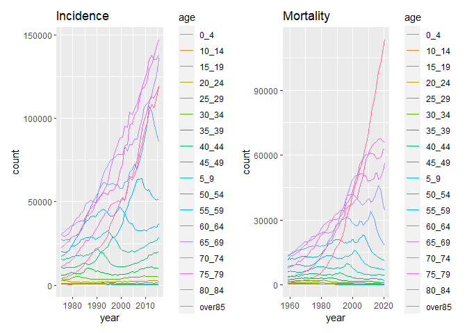<!-- -->

It seems that people in older age, which is over 70 are high both in
incidence and mortality counts. We are focusing on older range than
70.  
And it is quite natural that both incidents and mortality counts have
increased because Japanese population is Aging year by year. We should
take into account population of old age at each time.  
We use incidents and mortality counts per 1,000 over 70.

``` r
d_incidence_old <- filter(d_incidence_long, age %in% c("70_74","75_79","80_84","over85")) %>% 
  group_by(code,part,year) %>% summarise(count = sum(count))
d_mortality_old <- filter(d_mortality_long, age %in% c("70_74","75_79","80_84","over85")) %>% 
  group_by(code,part,year) %>% summarise(count = sum(count))
df_pop_old <- filter(df_pop, age %in% c("70_74","75_79","80_84","over85")) %>%
  group_by(year) %>% summarise(population=sum(population))

# adjust population and cancer counts
df_incidence <- left_join(d_incidence_old,df_pop_old,by="year") %>% 
  mutate(adj_count=count/population*1000)
df_mortality <- left_join(d_mortality_old,df_pop_old,by="year") %>% 
  mutate(adj_count=count/population*1000)
```

We have 28 different types of cancer data. Here we use only 4 parts;
liver, bile duct, lymphoma and large intestine in order to make
prediction simpler.

**For information, liver and bile duct cancer are decreasing wheres
lymphoma and large intestine are increasing.**

### Cancer Incidence

Make time series data by indications from 1975 to 2015

``` r
df_incidence_liver <- ts(df_incidence[df_incidence$code==8,"adj_count"],start = 1975, frequency = 1)
df_incidence_bil <- ts(df_incidence[df_incidence$code==9,"adj_count"],start = 1975, frequency = 1)
df_incidence_lymph <- ts(df_incidence[df_incidence$code==25,"adj_count"],start = 1975, frequency = 1)
df_incidence_lintes <- ts(df_incidence[df_incidence$code==67,"adj_count"],start = 1975, frequency = 1)
```

``` r
ggtsdisplay(df_incidence_liver, main = "Liver")
```

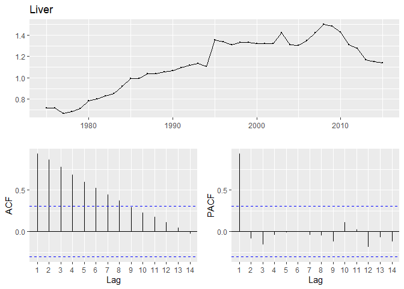<!-- -->

``` r
ggtsdisplay(df_incidence_lymph, main = "lymphoma")
```

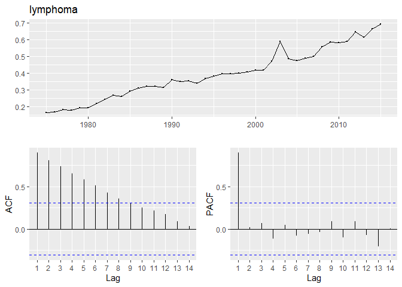<!-- -->

``` r
ggtsdisplay(df_incidence_lintes, main = "intestine")
```

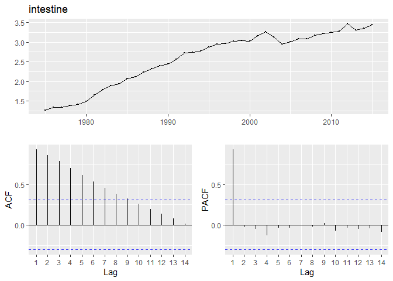<!-- -->

``` r
ggtsdisplay(df_incidence_bil, main = "bile duct")
```

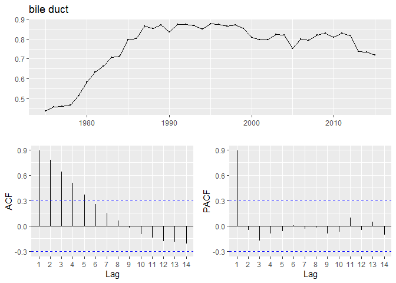<!-- -->

Considering plots above, auto correlation could be problematic.  
Usually, this kind of correlation can be better by lagged.

``` r
ggtsdisplay(diff(df_incidence_liver), main = "diff_Liver")
```

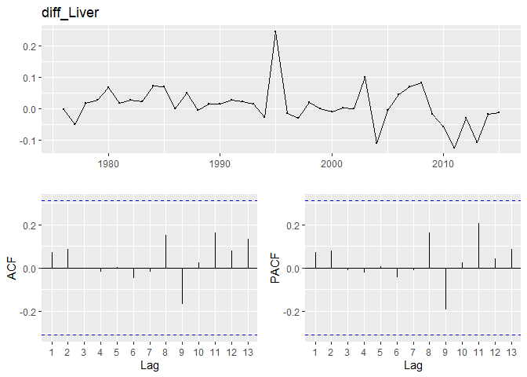<!-- -->

``` r
ggtsdisplay(diff(df_incidence_lymph), main = "diff_limphoma")
```

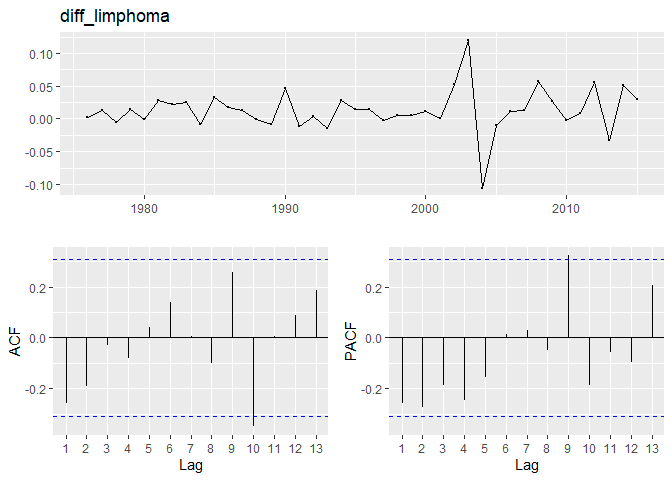<!-- -->

``` r
ggtsdisplay(diff(df_incidence_lintes), main = "diff_intestine")
```

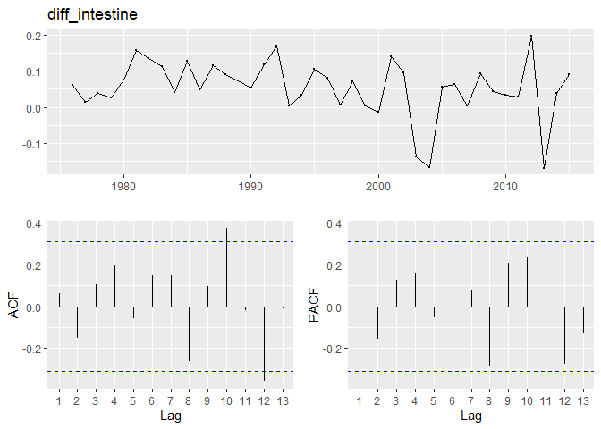<!-- -->

``` r
ggtsdisplay(diff(df_incidence_bil), main = "diff_bile duct")
```

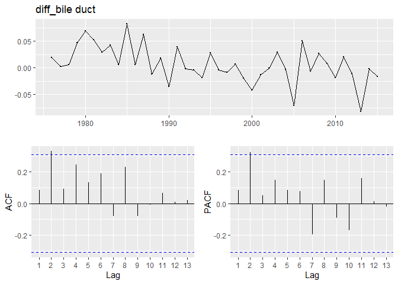<!-- -->

By lagging 1 year, time series change gets more stationary. In this
case, ARIMA model might be suitable.  
Here, train models by using data between 1975 to 2010, then predict 2011
to 2015 and compare behaviors between actual and predicted data.

``` r
# make training data
df_incidence_train <- filter(df_incidence, year<"2011-01-01")
df_incidence_train_liver <- ts(df_incidence_train[df_incidence_train$code==8,"adj_count"],start = 1975, frequency = 1)
df_incidence_train_lymph <- ts(df_incidence_train[df_incidence_train$code==25,"adj_count"],start = 1975, frequency = 1)
df_incidence_train_lintes <- ts(df_incidence_train[df_incidence_train$code==67,"adj_count"],start = 1975, frequency = 1)
df_incidence_train_bil <- ts(df_incidence_train[df_incidence_train$code==9,"adj_count"],start = 1975, frequency = 1)

# train models
train_incidence.liver <- auto.arima(df_incidence_train_liver,ic="aic",stepwise = F,approximation = F)
train_incidence.lymph <- auto.arima(df_incidence_train_lymph,ic="aic",stepwise = F,approximation = F)
train_incidence.lintes <- auto.arima(df_incidence_train_lintes,ic="aic",stepwise = F,approximation = F)
train_incidence.bil <- auto.arima(df_incidence_train_bil,ic="aic",stepwise = F,approximation = F)

# make plots
p_incidence_liver <- autoplot(df_incidence_liver) + autolayer(train_incidence.liver$fitted) + autolayer(forecast(train_incidence.liver,h=6),series = "ARIMA",alpha=.5) + labs(title = "Liver")
p_incidence_lymph <- autoplot(df_incidence_lymph) + autolayer(train_incidence.lymph$fitted) + autolayer(forecast(train_incidence.lymph,h=6),series = "ARIMA",alpha=.5) + labs(title = "Lymphoma")
p_incidence_lintes <- autoplot(df_incidence_lintes) + autolayer(train_incidence.lintes$fitted) + autolayer(forecast(train_incidence.lintes,h=6),series = "ARIMA",alpha=.5) + labs(title = "Intestine")
p_incidence_bil <- autoplot(df_incidence_bil) + autolayer(train_incidence.bil$fitted) + autolayer(forecast(train_incidence.bil,h=6),series = "ARIMA",alpha=.5) + labs(title = "Bile duct")
```

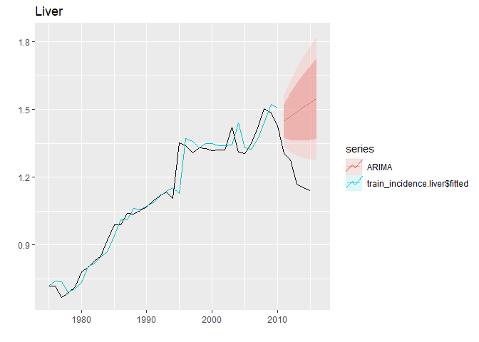<!-- -->

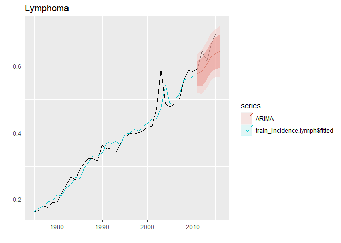<!-- -->

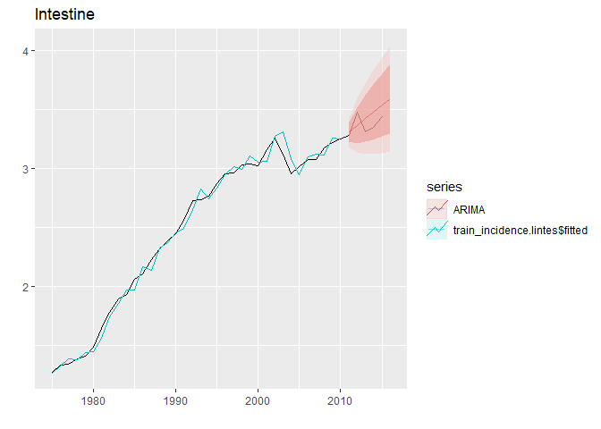<!-- -->

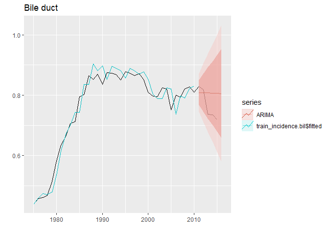<!-- -->

Lymphoma and Intestine (Large Intestine) are fairly well predicted while
liver and bile duct are not. Especially, predicted liver moves against
actual data. around 2010, some breakthrough might have happened then a
number of patients ends up with decreasing.

### Cancer Mortality

Make time series data by indications from 1958 to 2020

``` r
df_mortality_liver <- ts(df_mortality[df_mortality$code==8,"adj_count"],start = 1958, frequency = 1)
df_mortality_bil <- ts(df_mortality[df_mortality$code==9,"adj_count"],start = 1958, frequency = 1)
df_mortality_lymph <- ts(df_mortality[df_mortality$code==25,"adj_count"],start = 1958, frequency = 1)
df_mortality_lintes <- ts(df_mortality[df_mortality$code==67,"adj_count"],start = 1958, frequency = 1)
```

``` r
ggtsdisplay(df_mortality_liver, main = "Liver")
```

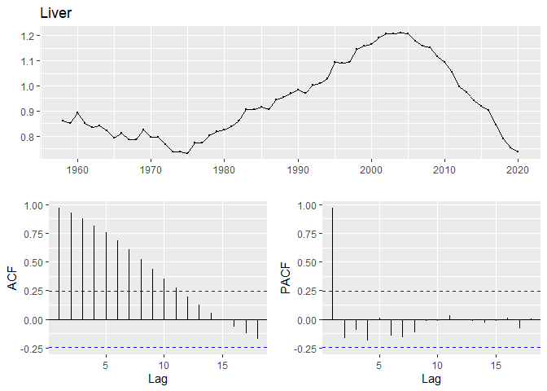<!-- -->

``` r
ggtsdisplay(df_mortality_lymph, main = "lymphoma")
```

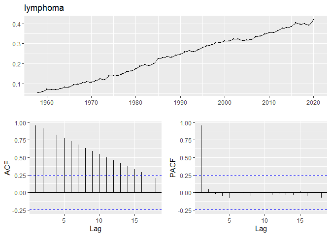<!-- -->

``` r
ggtsdisplay(df_mortality_lintes, main = "intestine")
```

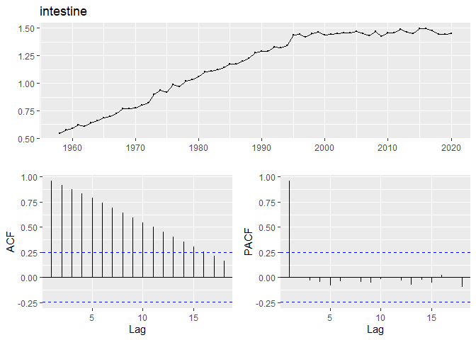<!-- -->

``` r
ggtsdisplay(df_mortality_bil, main = "bile duct")
```

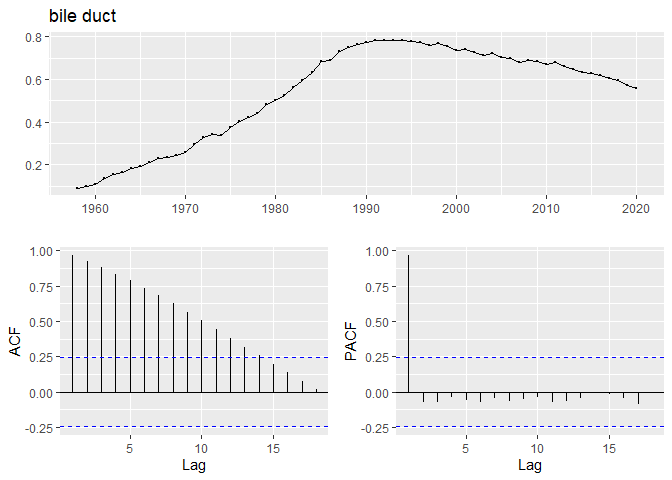<!-- -->

Considering plots above, auto correlation could be problematic as well
as incident data was. So, get them lagged by a year.

``` r
ggtsdisplay(diff(df_mortality_liver), main = "diff_Liver")
```

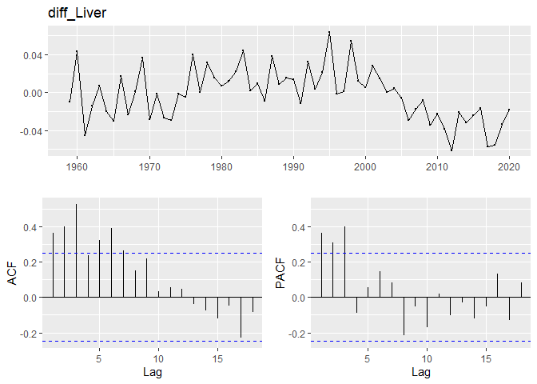<!-- -->

``` r
ggtsdisplay(diff(df_mortality_lymph), main = "diff_limphoma")
```

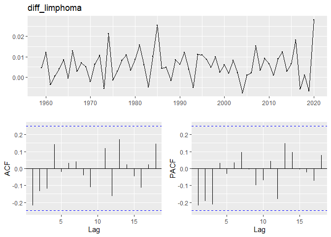<!-- -->

``` r
ggtsdisplay(diff(df_mortality_lintes), main = "diff_intestine")
```

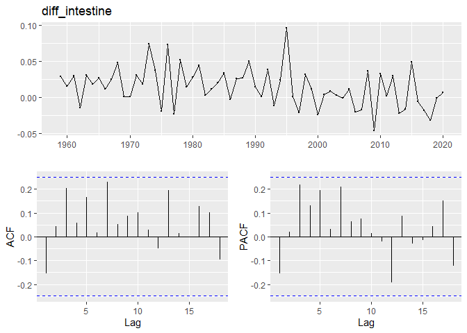<!-- -->

``` r
ggtsdisplay(diff(df_mortality_bil), main = "diff_bile duct")
```

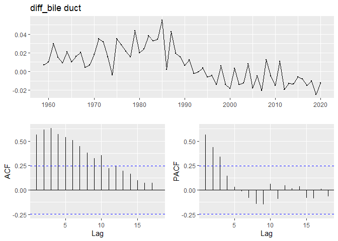<!-- -->

By lagging 1 year, time series change gets a little more stationary but
not drastically. In this case, ARIMA model might be suitable but lag can
be larger than incidence.  
Here, train models by using data between 1958 to 2009, then predict 2010
to 2020 and compare behaviors between actual and predicted data.

``` r
# make training data
df_mortality_train <- filter(df_mortality, year<"2010-01-01")
df_mortality_train_liver <- ts(df_mortality_train[df_mortality_train$code==8,"adj_count"],start = 1958, frequency = 1)
df_mortality_train_lymph <- ts(df_mortality_train[df_mortality_train$code==25,"adj_count"],start = 1958, frequency = 1)
df_mortality_train_lintes <- ts(df_mortality_train[df_mortality_train$code==67,"adj_count"],start = 1958, frequency = 1)
df_mortality_train_bil <- ts(df_mortality_train[df_mortality_train$code==9,"adj_count"],start = 1958, frequency = 1)

# train models
train_mortality.liver <- auto.arima(df_mortality_train_liver,ic="aic",stepwise = F,approximation = F)
train_mortality.lymph <- auto.arima(df_mortality_train_lymph,ic="aic",stepwise = F,approximation = F)
train_mortality.lintes <- auto.arima(df_mortality_train_lintes,ic="aic",stepwise = F,approximation = F)
train_mortality.bil <- auto.arima(df_mortality_train_bil,ic="aic",stepwise = F,approximation = F)

# make plots
p_mortality_liver <- autoplot(df_mortality_liver) + autolayer(train_mortality.liver$fitted) + autolayer(forecast(train_mortality.liver,h=11),series = "ARIMA",alpha=.5) + labs(title = "Liver")
p_mortality_lymph <- autoplot(df_mortality_lymph) + autolayer(train_mortality.lymph$fitted) + autolayer(forecast(train_mortality.lymph,h=11),series = "ARIMA",alpha=.5) + labs(title = "Lymphoma")
p_mortality_lintes <- autoplot(df_mortality_lintes) + autolayer(train_mortality.lintes$fitted) + autolayer(forecast(train_mortality.lintes,h=11),series = "ARIMA",alpha=.5) + labs(title = "Intestine")
p_mortality_bil <- autoplot(df_mortality_bil) + autolayer(train_mortality.bil$fitted) + autolayer(forecast(train_mortality.bil,h=11),series = "ARIMA",alpha=.5) + labs(title = "Bile duct")
```

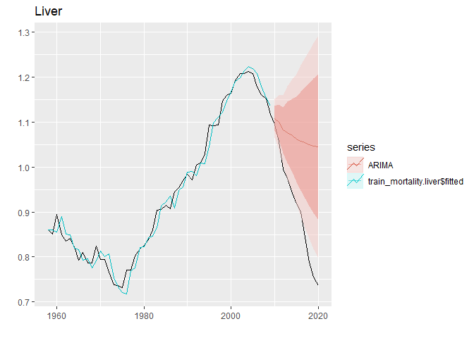<!-- -->

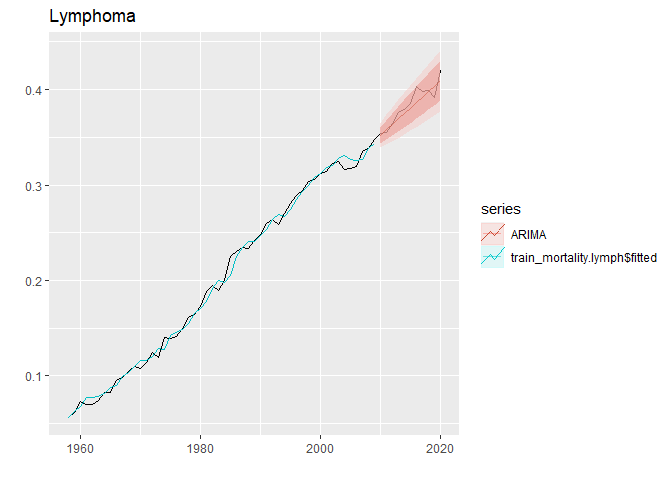<!-- -->

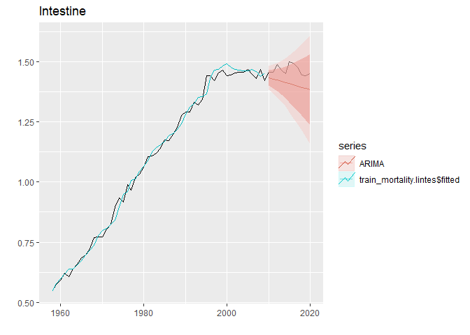<!-- -->

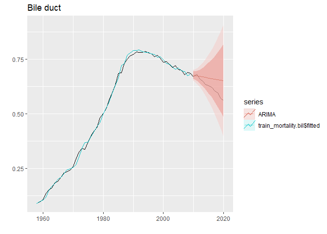<!-- -->

Lymphoma is well predicted. Liver and bile duct are predicted to be
decreasing, but the gradients of them are steeper in actual data than in
predicted data. Unfortunately, actual data of large intestine is higher
than predicted data. This fact might indicate that the case is likely to
be worse than we would consider it to be.

## Conclusion

In this analysis, we just used time series data and did not consider
environmental factor such as new drugs, medical breakthrough at all. But
from these results, we can discuss and look into background.  
For example, it was a good tendency for us that liver and bile duct
mortality rates were lower than predicted because it might mean that
life science technology has been advanced faster than we thought.
However, when it comes to large intestine, mortality rate is higher than
prediction, which might mean that our diet is getting unhealthier.
